# Exploring, Analyzing, and Modeling 58 years of Popular Music

- [Introduction](#introduction)
- [Building the Dataset](#building-the-dataset)
- [Analysis of Audio Features](#analysis-of-audio-features)
    + [Better Technology and Worse Attention Spans](#better-technology-and-worse-attention-spans)
    + [Cutting Out the Instrumental Fat](#cutting-out-the-instrumental-fat)
    + [The Rise of Rap and Hip-Hop](#the-rise-of-rap-and-hip-hop)
    + [Correlation Structure](#correlation-structure)
    + [More Energy](#more-energy)
    + [Sad Dancing](#sad-dancing)
    + [The Loudness Wars](#the-loudness-wars)
    + [The Big Picture](#the-big-picture)
    + [Embedding in Latent Audio Space](#embedding-in-latent-audio-space)
- [Analysis of Artists](#analysis-of-artists)
    + [Extreme Artists](#extreme-artists)
    + [Madonna is the Queen of Pop](#madonna-is-the-queen-of-pop)
    + [Flash in the Pan vs. Steady Burn](#flash-in-the-pan-vs-steady-burn)
    + [Declining Artist Diversity](#declining-artist-diversity)
    + [An Increasingly Connected World](#an-increasingly-connected-world)
- [Analysis of Lyrics](#analysis-of-lyrics)
    + [Love Conquers All](#love-conquers-all)
    + [Love is Not Forever](#love-is-not-forever)
    + [Singing About Her](#singing-about-her)
    + [Pronouns](#pronouns)
    + [Related Words](#related-words)
    + [Topic Modeling](#topic-modeling)
    + [Sign of the Times](#sign-of-the-times)
    + [Extreme Words](#extreme-words)
- [Conclusion](#conclusion)

## Introduction
#### A Reboot of a Prior Project
This analysis originated as a [group-based final project](https://github.com/manksh/EDAV_Dream_Team) for a course in my M.S. in Data Science program called [STAT 5702: Exploratory Data Analysis and Visualization](http://www.columbia.edu/cu/bulletin/uwb/subj/STAT/GR5702-20181-001/). In that project, we examined the lyrics and audio features of America's most popular songs from **1965**-**2015** to gain insights about how our culture and music industry has evolved. However, because the project was conducted primarily in R despite our much greater proficiency with Python, we were relatively hamstrung and had to limit the scope and depth of our explorations. After finishing the class and free to explore the data without constraints, I decided to revisit and extend the project in Python for a more comprehensive analysis.

#### Motivation
Popular music offers a unique lens through which to study what preoccupies a society, what people value in their entertainment, and how cultural preferences change with each generation. [Billboard Magazine](https://en.wikipedia.org/wiki/Billboard_(magazine)) publishes a yearly chart, the [Year-End Hot 100](https://en.wikipedia.org/wiki/Billboard_Year-End) that ranks the best-performing singles of the United States based on data collected from physical sales, digital sales, radio airplay, and streaming. Many text mining analyses have been performed on the lyrics of these songs, with [Kaylin Pavlik's](https://www.kaylinpavlik.com/50-years-of-pop-music/), whose dataset my group used in the original project, among the most notable. To build on these ideas, for each song, we also incorporated audio-feature data (such as loudness, tempo, danceability, etc.) maintained by Spotify. The combination of data from the Billboard rankings, song lyrics, and Spotify audio features provides many avenues for rich and interesting analysis.

## Building the Dataset
The [dataset](https://github.com/walkerkq/musiclyrics/blob/master/billboard_lyrics_1964-2015.csv) we originally used consisted of Billboard Year-End Hot 100 Singles from **1965** to **2015** and each single's corresponding lyrics. However, I wanted to build my own dataset for two reasons:

1. As of writing, the Billboard Year-End charts that are available extend from **1960** to **2017**, providing **8** more years of data from which to extrapolate trends.
2. A significant proportion of lyrics in the original dataset contained fused words, where the last word of a line was combined with the first word of the next line. Such an issue posed many obstacles to a clean analysis of the lyrics.

To obtain songs and rankings from Billboard's Year-End Hot 100 charts, I scraped the data from relevant [Wikipedia tables](https://en.wikipedia.org/wiki/Billboard_Year-End_Hot_100_singles_of_2017) for **1960**-**2017**. Because some songs are released at the end of the year, they might chart in the year of its release and in the following year. There were **235** such duplicates, not counting the original songs, and they were removed from the dataset.

Collecting lyrics for each song proved more involved. Many music services offer API's to query for song lyrics, but all either charge a fee, limit the number of songs that can be queried, or return only a proportion of the lyrics. Fortunately, [genius.com](https://genius.com/Woodkid-run-boy-run-lyrics), [songlyrics.com](http://www.songlyrics.com/woodkid/run-boy-run-lyrics/), [lyricsmode.com](http://www.lyricsmode.com/lyrics/w/woodkid/run_boy_run.html), and [metrolyrics.com](http://www.metrolyrics.com/run-boy-run-lyrics-woodkid.html) serve lyrics on webpages that follow consistent URL naming conventions, meaning the lyric data could also be scraped. For each song, scrapes are conducted sequentially through the four websites; if the scrape of a website fails, then the next website is attempted unless all four have already been exhausted.

Much attention was paid to normalizing the names of artists and songs from the initial Wikipedia scrape (e.g. changing _Sean Combs_ and _P. Diddy_ to _Puff Daddy_) and preparing them into a format suitable for conversion to a URL string (e.g. changing from _Hall & Oates_ to _Hall and Oates_). While scraping for lyrics failed in **3.6%** of songs in the original dataset my group used, doing so with cleaned Wikipedia data resulted in failed scrapes accounting for less than **1%** (**0.78%**) of all songs. The vast majority of lyrics were obtained from genius.com (**93.8%**), with songlyrics.com accounting for almost all of the remaining lyrics (**5.6%**).

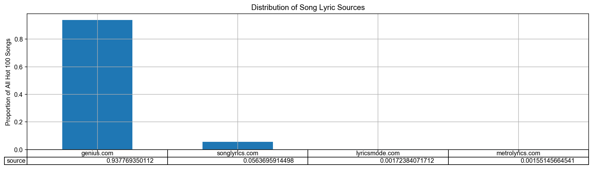

Spotify's audio feature data was then accessed directly by querying Spotify's API using the Billboard Hot 100 songs obtained from Wikipedia. Approximately **3%** of all songs were not queried successfully from Spotify (though this is down from **10%** when using the original dataset).

The final de-duplicated dataset consists of **5566** singles, of which **5396** have Spotify audio feature data and **5516** have lyrics.

## Analysis of Audio Features

The audio features collected from Spotify cover a wide range of metrics, with some related to the content of the lyrics, some measuring objective properties of the song, and most interestingly, some measuring subjective properties like how danceable or positive-feeling a song is. Below are distributions of each feature and a brief explanation of their meaning.

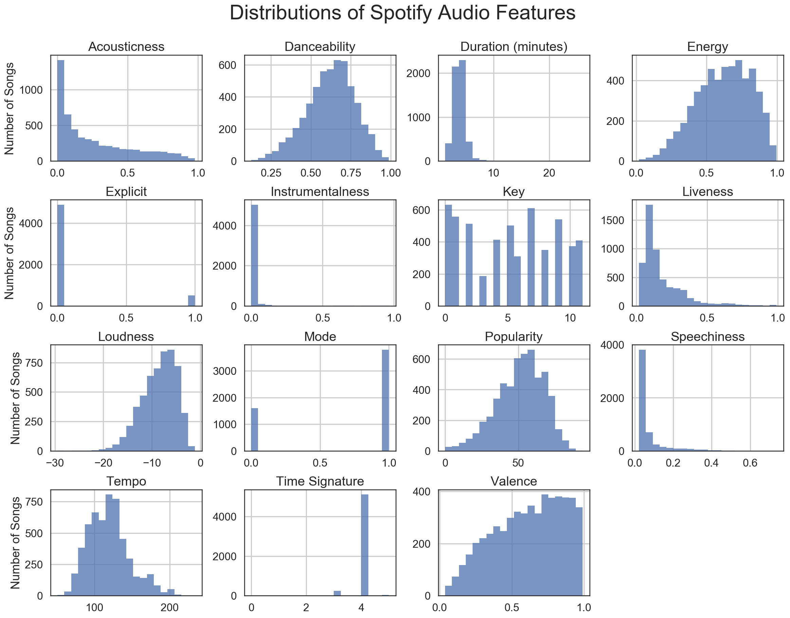

- **Acousticness** describes whether the song uses primarily acoustic instruments or electronic/electric instruments. A value of **1.0** indicates that a song is purely acoustic, and from the histogram it appears a large majority of popular music uses electric and electronic instruments rather than acoustic instruments.
- **Danceability** describes how suitable a track is for dancing based on a combination of musical elements including tempo, rhythmic stability, beat strength, and overall regularity, with a value of **1.0** indicating high danceability. The danceability of Hot 100 songs appears to be normally distributed.
- **Duration (minutes)** simply indicates the length of the song. Most songs are between **3**-**5** minutes long, however the Year-End Hot 100 charts contain at least one song of over **20** minutes in length.
- **Energy** is different from danceability in that it is a perceptual measure of intensity and activity. Energetic tracks feel dense, fast, loud, and noisy. For example, death metal would have a high energy value while a Bach prelude would have a low one. Songs on the Year-End Hot 100 are unsurprisingly skewed towards having higher energy.
- **Explicit** is a categorical feature, with **1** indicating that a song contains explicit lyrics. The vast majority of Hot 100 songs are not explicit.
- **Instrumentalness** describes the extent to which the singer is not the primary performer of the song. Unsurprisingly, almost all songs on the Hot 100 are dominated by vocal performances.
- **Key** represents the key signature the track is in. Integers map to pitches using [standard pitch class notation](https://en.wikipedia.org/wiki/Pitch_class#Integer_notation) where 0 = C, 1 = C#/Db, 2 = D, etc.
- **Liveness** detects the presence of an audience in the recording. Higher liveness values represent an increased probability that the song was performed and recorded live. It appears that most Hot 100 singles are studio-recorded.
- The overall **loudness** of a recording is measured in decibels (dB). Loudness values are averaged across the entire song and typically range between **-60dB** and **0dB**.
- **Mode** indicates whether a song is in primarily a major key or a minor key. I had expected most popular songs to be in a minor key, so was surprised see that almost **2/3** of Hot 100 hits are actually in a major key.
- The **popularity** of a song is a metric of how often the song has been streamed on Spotify，but with more recent streams weighted more heavily. It can be thought of as a proxy for some combination of the song's Billboard rank and recency.
- **Speechiness** detects the presence of spoken words in a recording. The more exclusively speech-like the recording (ex. talk shows, audio books, etc.), the closer the speechiness is to **1.0**. Naturally, no Hot 100 singles have a speechiness of **1.0**, but a significant number have non-zero speechiness, most likely rap songs.
- A song's **tempo** is its speed, or the number of beats per minute (BPM). Tempo roughly appears to be normally distributed around **120BPM**.
- The **time signature** is a notational convention to specify how many beats are in each bar of music. Almost all Hot 100 songs have **4** beats per bar, but a small number of hits have **3** beats per bar, also known as triple meter. These are probably slower ballads. A few songs have time signature values of **less than 3**, which are almost certainly errors.
- **Valence** describes the musical positiveness conveyed by the song. In other words, songs with high valence sound more happy/positive/cheerful while songs with low valance sound more negative/depressed/angry. The data shows that Hot 100 singles are more likely to have high valance, which is in keeping with the observation that Hot 100 singles are also more likely to be in a major key.

Source: [Spotify API](https://beta.developer.spotify.com/documentation/web-api/reference/tracks/get-audio-features/)

#### Better Technology and Worse Attention Spans

The boxplots below show the distribution of Hot 100 song durations for each year.

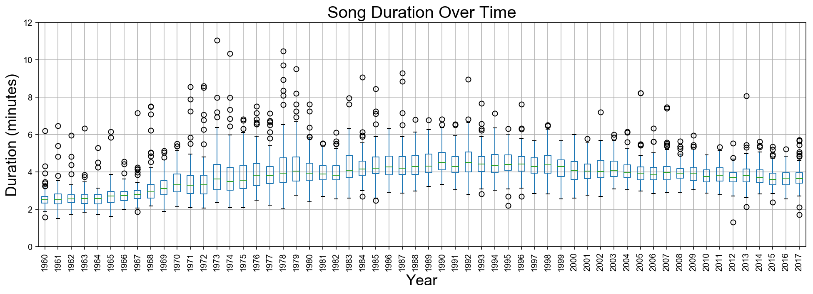

Between **1960** and **1990**, songs saw a nearly uninterrupted increase in median duration from about **~2.5** minutes to **~4.5** minutes, which could be due to the [invention](https://www.timetoast.com/timelines/music-storage-through-time) of the casette tape in the early **1960s** and compact disc in the early **1980s**. Both were new mediums that could store much more music than vinyl records, allowing songs to become much longer. From **1990** onward, Hot 100 songs have gradually shortened to **~3.6** minutes, possibly driven by competition for radio airplay and [diminishing attention spans](https://news.osu.edu/news/2017/04/04/streaming-attention/). Since **2010**, the availability of streaming platforms offers listeners a much wider choice of music than ever before, incentivizing artists to keep songs shorter and tighter lest they be skipped.

#### Cutting Out the Instrumental Fat

The plots below are also boxplots, but of songs' instrumentalness for each year. Because the vast majority of Hot 100 songs contain little to no instrumetal sections, the median instrumentalness of songs is almost always **0** each year. However, the change in distribution and number of outliers over time shows that the overall instrumentalness of Hot 100 music has been steadily declining.

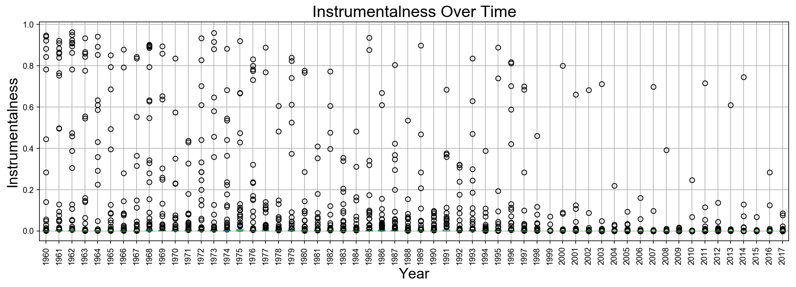

There are two possible factors driving the overall trend:

1. Pure instrumental has become increasingly less popular (e.g. classical and New Age music)
2. The shortening of songs due to declining attention spans means that the instrumental sections of songs, such as intros, interludes, solos, and outros, are [among the first to get cut](https://news.osu.edu/news/2017/04/04/streaming-attention/).

#### The Rise of Rap and Hip-Hop
For each song, the number of words per second (WPS) was calculated by dividing the number of words in the lyrics by the duration of the song in seconds. The time series box plots of WPS show that from the early **1990s** to the **2010s**, songs have become considerably denser in their textual content as the delivery of words became steadily faster. During this period, the median speechiness of songs rose dramatically, as did the number of explicit Hot 100 songs each year.

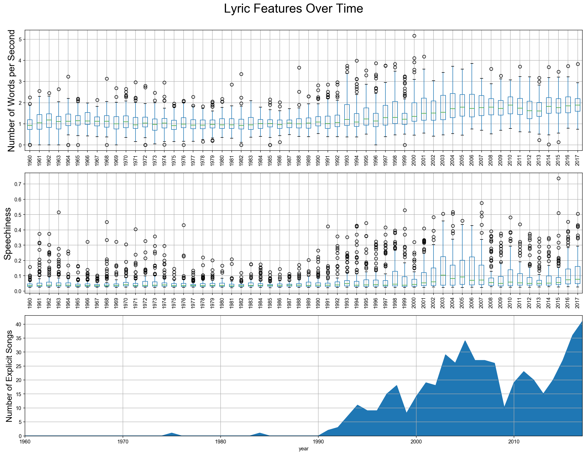

In 1991, a [change in Billboard's tracking methodology](https://www.theatlantic.com/entertainment/archive/2015/05/1991-the-most-important-year-in-music/392642/) suddenly gave rap and hip-hop a new prominence on its charts. The sudden success of both genres begot more success, and as the genres grew, they likely drove the increase in median words per second, median speechiness, and number of explicit songs.

#### Correlation Structure
The correlation heatmap below shows how the Spotify audio features relate to one another. While most pairs of features have correlation coefficients (R) near **0**, indicating no meaningful linear relationship, a small handful of feature pairs are weakly to moderately related:

- Energy vs. loudness: moderately correlated with **R=0.7**
- Speechiness vs. explicit: weakly correlated with **R=0.48**
- Danceability vs. valence: weakly correlated wtih **R=0.45**
- Acousticness vs. energy: weakly anti-correlatated with **R=-0.57**

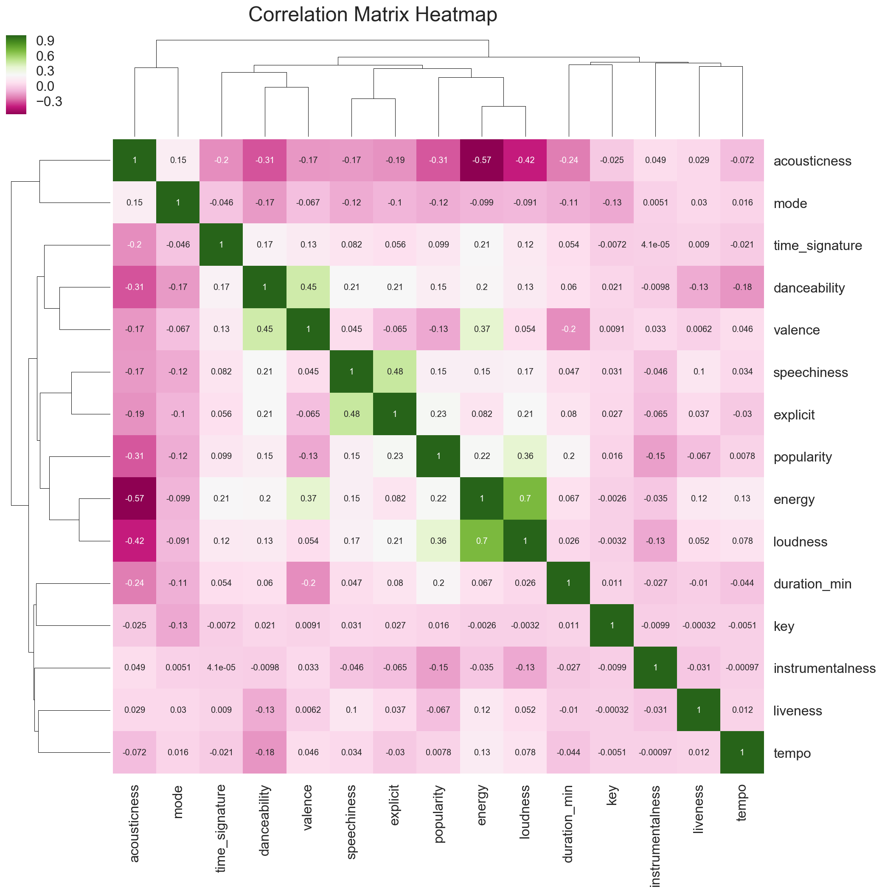

The following three scatter plots and [violin plot](https://en.wikipedia.org/wiki/Violin_plot) show the relationships between the aforementioned features in more detail. Intuitively, it makes sense that loudness and energy are positively correlated; a song's loudness is calculated as an average of loudness values throughout the entire song, and denser, faster music naturally results in a higher average loudness.

The relationship between acousticness and energy would be better approximated with a non-linear model, yet the basic relationship still holds; the greater the proportion of acoustic instruments in a song, the lower the energy of the song.

I initially found the positive correlation between danceability and valence rather surprising since dance music this decade does not seem particularly "positive-sounding". It so happens that this relationship is more prominent in older songs (discussed later).

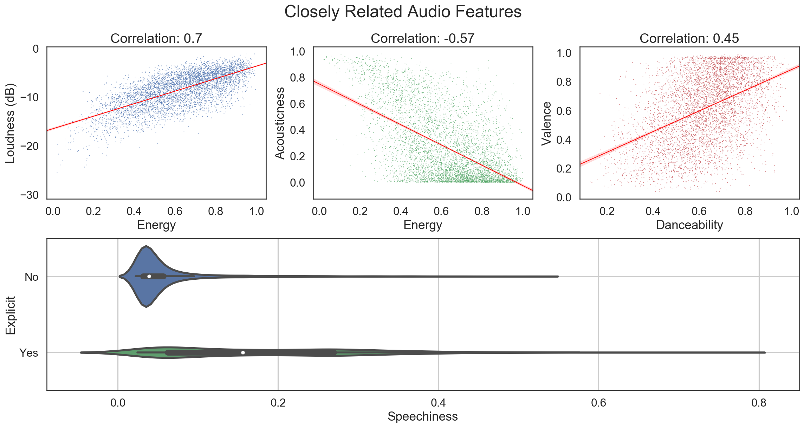

We previously saw that the rise in the median speechiness of songs and the number of expicit songs is closely linked, and the above violin plot shows that the median speechiness of explicit Hot 100 songs is **~0.1** higher than that of non-explicit Hot 100 songs.

#### More Energy
The negative relationship between acousticness and energy becomes more interesting when we account for how it has evolved over the years. The smaller scatterplots show the acousticness and energy of each Hot 100 song faceted by decade, while the larger scatterplot shows the acousticness and energy of all Hot 100 songs with release year expressed as a color.

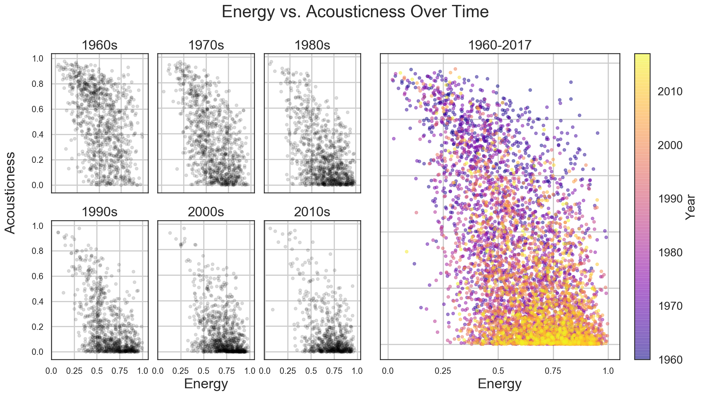

There is a clear trend of decreasing acousticness and increasing energy over time. The distribution of acousticness and energy is much more even during the **1960s** and even forms a slight cluster around **0.8** acousticness and **0.33** energy. However, even by the **1970s**, the densest region in the distribution is near **0.0** acousticness and **0.75** energy. With each passing decade, the number of Hot 100 songs with acousticness exceeding **0.2** becomes less frequent, and the distribution in the energy of these songs tightens around **0.75**.

The high acousticness of Hot 100 songs in the early **1960s** was actually a backlash to the electric guitar, invented in the **1930s**, and the subsequent rock and roll movement of the **1940s** and **1950s**. From [Liverpool Museums](http://www.liverpoolmuseums.org.uk/wml/exhibitions/thebeatgoeson/thebeatgoesonline/technology/instruments/electricguitar.aspx):
> Many musicians and listeners were unenthusiastic about the new instrument’s sound and the way it was used. This attitude, which was often hostile, was fundamental in a turn back to more folk-like sounds and the eventual development of the so-called folk revival of the late 1950s and 1960s. Basic to this movement and to many of its successive phases was a dislike of a sound that was produced by electricity, rather than by more ‘natural’ means.

The popularity of synthesizers in the late **1970s** and **1980s** likely further contributed to the decline of acoustic music in the Hot 100, followed by the increasing prominence of EDM during the **2000s**.

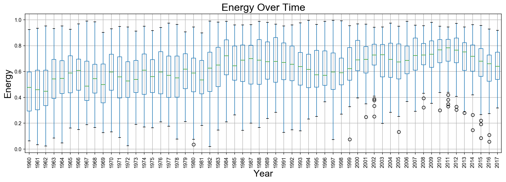

#### Sad Dancing

Another fascinating trend in the data is that the danceability of Hot 100 songs has been rising while the valence (positivity) has been declining.

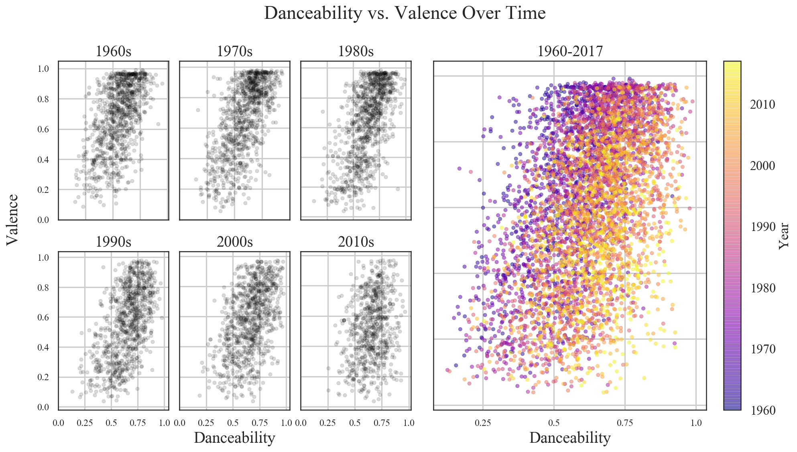

From the **1960s** to the **1980s**, the densest regions of the distribution of valence and danceability were at valences close to **1.0**, but from the **1990s** onwards, that cluster vanished. Furthermore, whereas there existed a weak positive correlation between danceability and valence in the earlier decades, the correlation gradually grew weaker starting from the **1990s**. Essentially, as time progressed, more songs became more danceable, yet highly danceable music became less "positive", resulting in an overall decline in valence over time.

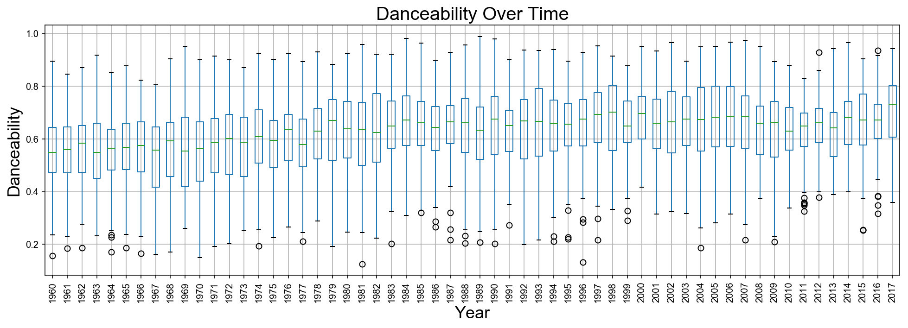

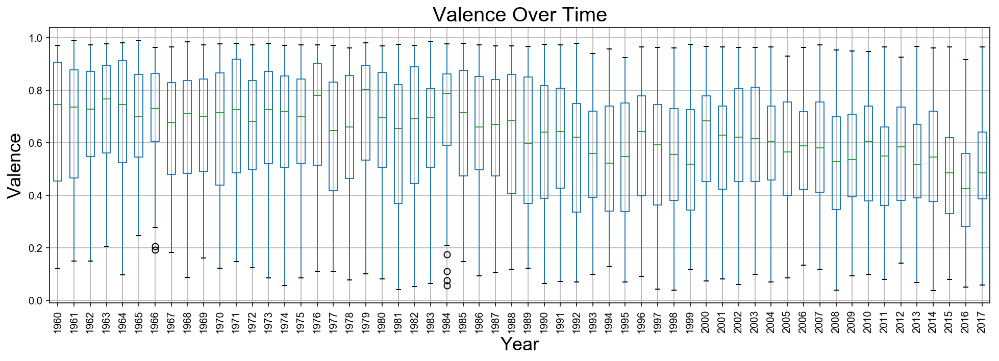

#### The Loudness Wars
One of the most unmistakable trends is that, in addition to becoming more energetic, Hot 100 music has also become louder and louder.

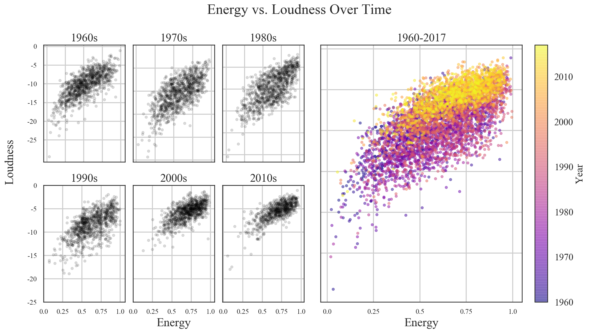

This phenomenon is called [The Loudness Wars](https://www.npr.org/2009/12/31/122114058/the-loudness-wars-why-music-sounds-worse). Listeners have a habit of preferring louder music over softer music, and as the music marketplace becomes increasingly crowded, the average volume of songs is pushed higher to stand out more, resulting in an inevitable "loudness arms race".

#### The Big Picture

The [parallel coordinate plot](https://en.wikipedia.org/wiki/Parallel_coordinates) below visualizes the relationships between all the key audio features. Each path extending from valence to acousticness represents a single song and is comprised of line segments that connect the values of each feature of the song. These values were rescaled to between **0.0** and **1.0** for ease of visualization.

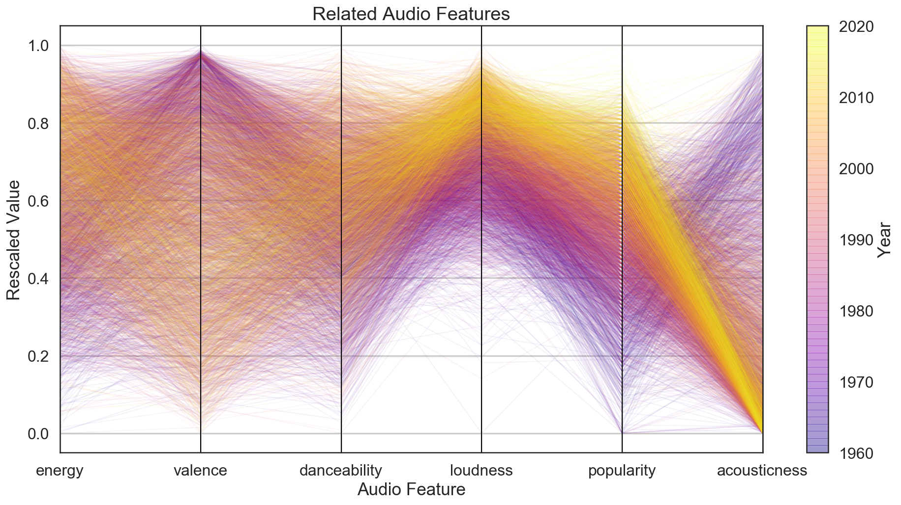

Here too, we can see that valence and danceability are positively correlated; higher valence values generally connect to higher danceability values relative to other songs of similar age. However, more recent Hot 100 songs tend to be much lower in valence and higher in danceability than older ones. Generally speaking, the newest songs tend to be higher energy, more danceable, less positive, louder, and less acoustic.

#### Embedding in Latent Audio Space

An embedding is a projection of high-dimensional data points, in this case 15 dimensions of audio feature data, into a lower-dimensional space. [T-distributed Stochastic Neighbor Embedding](https://distill.pub/2016/misread-tsne/), or TSNE, is a particularly effective method for non-linearly compressing data into a 2 or 3-dimensional space suitable for visualization; similar points are pulled together while dissimilar points are pushed away. In addition to songs, I averaged the audio features for each artist, decade, and a few other properties and included them in the embedding as well.

Usually the axes of a tSNE embedding hold no significant meaning, but because of the data's correlation structure, the y-axis appears to be some non-linear composite of the time-dependent features discussed previously. Particularly interesting is the fact that the top-ranked singles of each year seem to have more of a "sonic recency" than other songs. It could be that the number one songs are trend-setters and that songs in subsequent years emulate certain properties of previous number one hits.

It is important to emphasize that these embeddings are based only on audio features; songs of different genres that stylistically sound nothing alike might still be projected next to each other because they contain similar features like acousticness, loudness, tempo, etc. For this reason, embedding only audio feature data may be of limited usefulness (Is embedding **My Sharona** next to **Hey Jude** really justified? Why is **Every Breath You Take** and **Bette Davis Eyes** so far along the recency axis?)

## Analysis of Artists
#### Extreme Artists
Using the Spotify audio feature data, I constructed audio feature profiles for each artist by averaging the features for each of their songs. The word clouds below show which artists have the highest values for each audio feature. Only artists with at least **5** Hot 100 songs are included since too small a sample may not be representative of the artist's overall work.

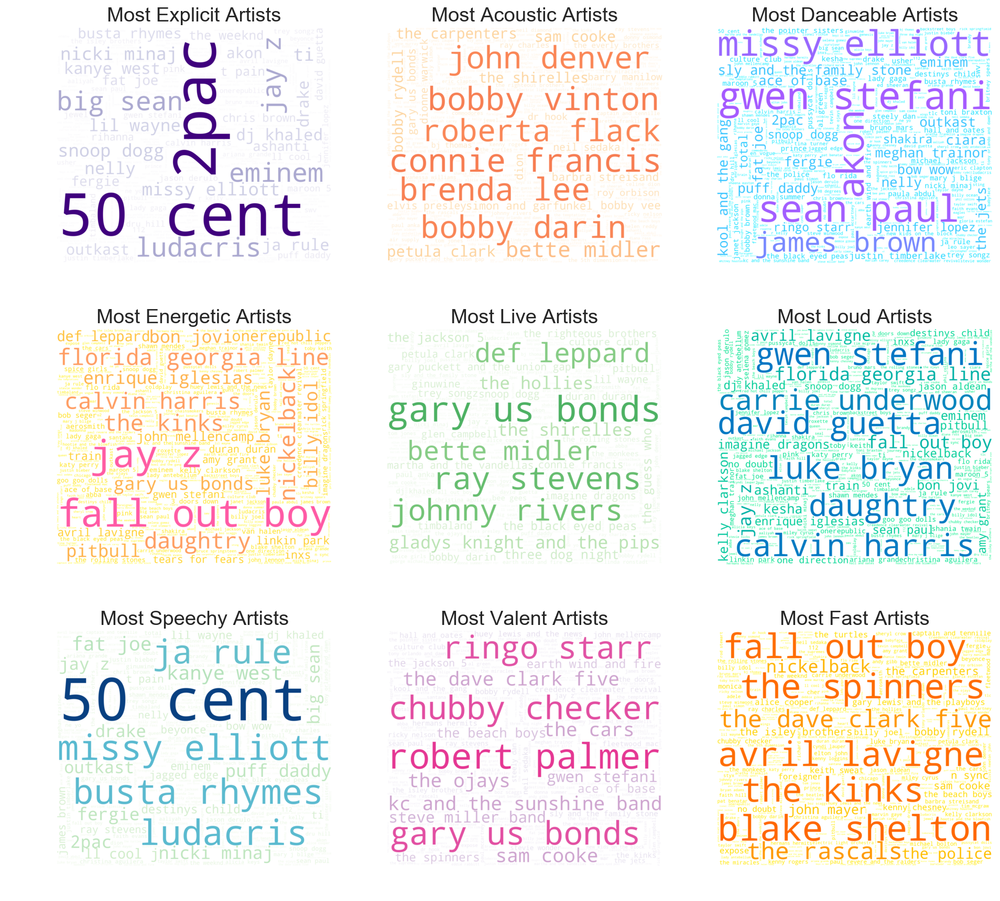

#### Madonna is the Queen of Pop
Perhaps the most natural first question to ask is simply, "Which artists have the most hit singles?" Amazingly, **Madonna** has charted **35** times and remains the only artist to have produced over **30** hot 100 singles since the **1960s**.

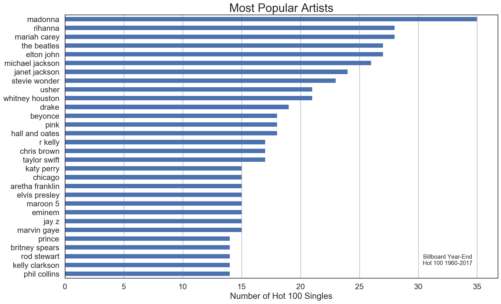

#### Flash in the Pan vs. Steady Burn
While legendary artists from **Madonna** to **Phil Collins** have forged successful careers with numerous hit songs, the vast majority of artists are not as fortunate. The histogram on the left shows that over **1,300** artists only ever generated **1** hit song. In fact, **58%** of charting artists are one-hit wonders and only able chart once in their careers, while **82%** of charting artists have charted **at most 3** times.

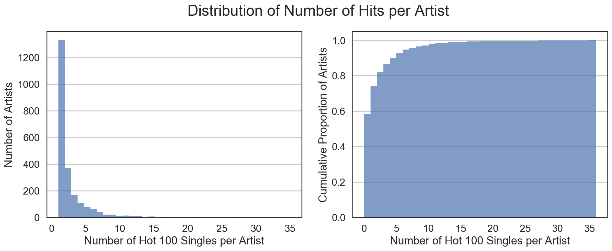

That half of all charting artists are flashes in the pan suggests that the Year-End Hot 100 is surprisingly diverse in terms of the number of unique artists that chart each year. It speaks to how competitive the music industry is; generating a hit single that lands on the Year-End Hot 100, and all the exposure such success entails, is far from a guarantee of maintaining a sustained career. Of those artists with steady-burn careers, I plotted their hit songs as points on separate timelines, one timeline for each artist. The timelines are displayed in order of length of the artist's career, calculated as the time elapsed from their earliest Hot 100 single to their latest.

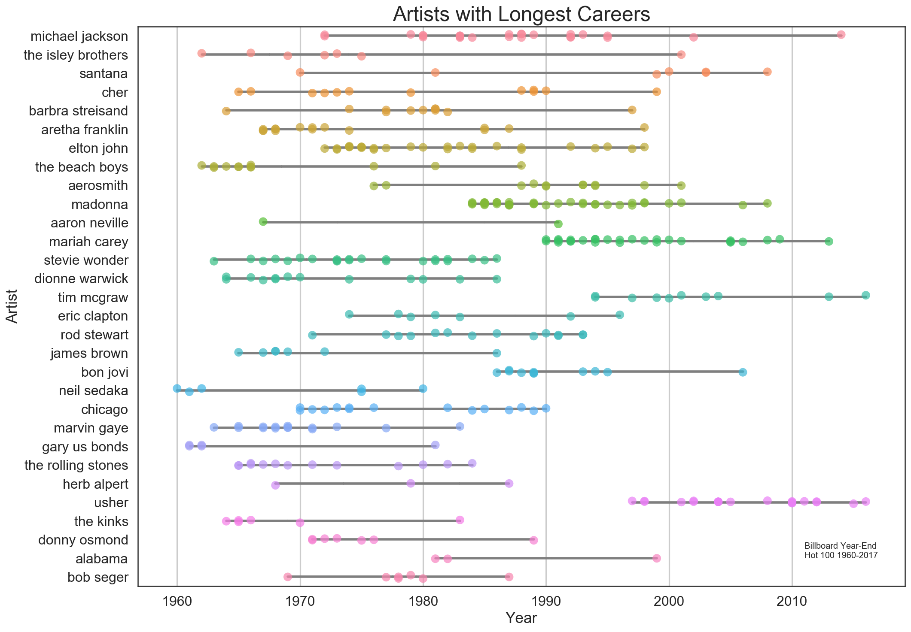

 <b>Note</b>: "Length of career span" is an imperfect metric since older artists may have had hits prior to 1960.

Surprisingly, some artists such as **Santana** and **Aaron Neville** did not produce as many hit singles as the most popular artists, yet still managed to chart on the Year-End Top 100 during vastly different decades of their careers.

#### Declining Artist Diversity
The number of unique artists on the Year-End Hot 100 is in general decline. The trend is quite noisy, so I smoothed it with a ten-year moving average. As recently as **2016**, close to half of all songs on the Year-End Hot 100 were from artists who charted at least twice that year, a far cry from **1972** when almost all of the top 100 songs were from distinct artists.

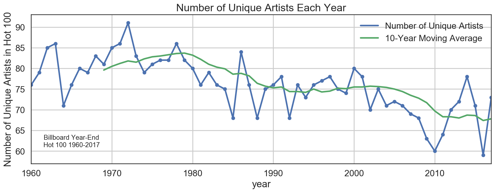

Particularly interesting is the sharp decline in artist diversity from **2000** to **2010**, a [traumatic decade of shrinking revenue for the entire industry](http://money.cnn.com/2010/02/02/news/companies/napster_music_industry/). It is possible that during this period, risk-averse record companies were only willing to produce, market, and distribute songs from established musicians and the occasional newly discovered superstar. In essence, as the pie shrunk, the superstars got larger pieces of it until the rise of digital streaming revenue in the early **2010s** partially stemmed the bleeding.

#### An Increasingly Connected World
In addition to a decline in artist diversity in the Year-End Hot 100 charts, there has been a marked increase in the number of collaborations from 1990 to the early **2000s**. Collaborations occur when an artist invites a guest artist to perform on her song and are usually denoted in the artist name as **[primary artist] featuring [guest artist(s)]**. Two possible reasons for the rise in artist collaborations come to mind:

1. Rap and hip-hop are inherently collaborative genres, and its rise to prominence in the **1990s** drove the increase in collaborations.
2. The contraction of the music industry **post-2000s** encouraged artists to appear together on songs to generate the necessary star-wattage to attract listeners' attention and to broaden their exposure with different audiences.

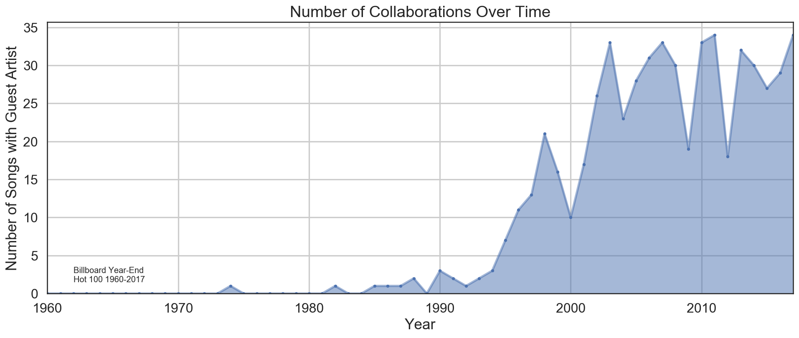

The two smaller plots below show which artists most frequently featured guest artists in their songs and which artists were most frequently featured as a guest, respectively. The larger bar plot simply counts collaborations per artist, regardless of whether the artist features another or is featured by another. From all three plots, it appears that the musicians who collaborate the most appear to be rappers and hip-hop artists.

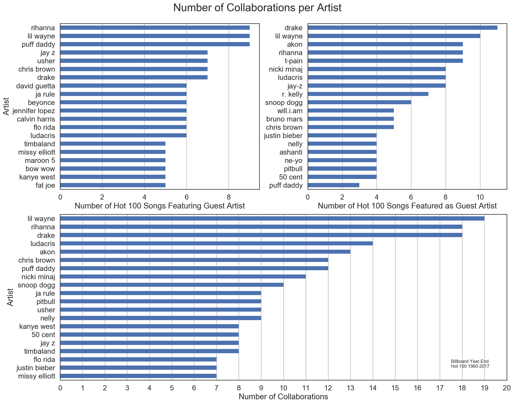

To visualize the structure of artist collaborations, I plotted the collaborations as a network in which the nodes (red circles) represent artists and edges (lines) represent a collaboration between two artists. Most of the edges are thin and purple, representing a single collaboration between two artists on the Year-End Hot 100, but the handful of peach-colored edges near the center represent two collaborations per artist pair, and the two thick blue edges represent four collaborations per artist pair.

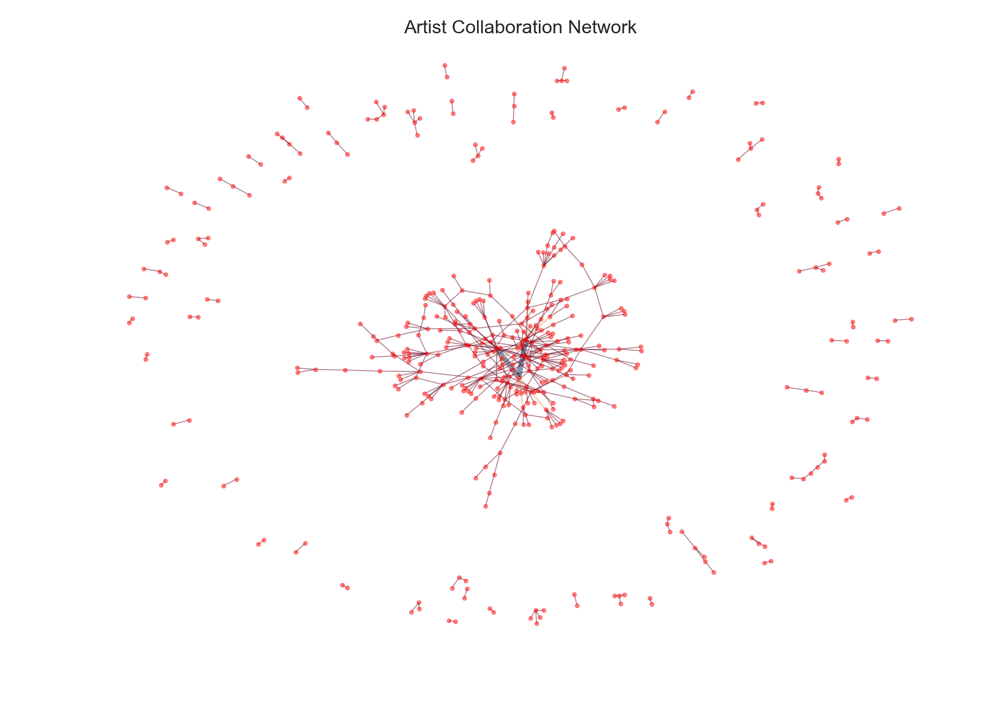

The vast majority of collaborations between two artists on the Year-End Hot 100 occur only once. The most notable exception is a well-connected artist in the center that has collaborated four times each with two different artists and twice with numerous others, **Drake**.

Focusing on the largest component of the network, I removed the numerous small and isolated sub-networks, and re-plotted the data so that artists with the most collaborations are placed closer to the center of the plot. With the addition of labeled points, we can see which artists tend to collaborate the most with others and who they have collaborated with.

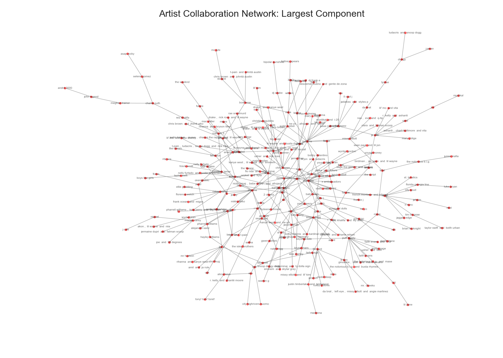

## Analysis of Lyrics

#### Love Conquers All
After removing common but uninformative words (also called [stop words](https://en.wikipedia.org/wiki/Stop_words)) from the whole [corpus](https://en.wikipedia.org/wiki/Text_corpus) of lyrics, **love** becomes the most frequently used word, followed by **know** and then **like**.

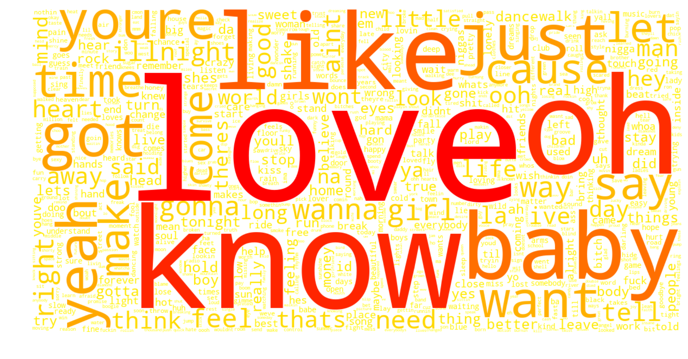

Bigrams are just combinations of two words. For example, the words/unigrams **ice** and **cream** together form a very common bigram, **ice cream**. In the case of Hot 100 song lyrics, the most common bigrams are, unsurprisingly, repetitions of words or sounds, often as a means of embellishing melodies.

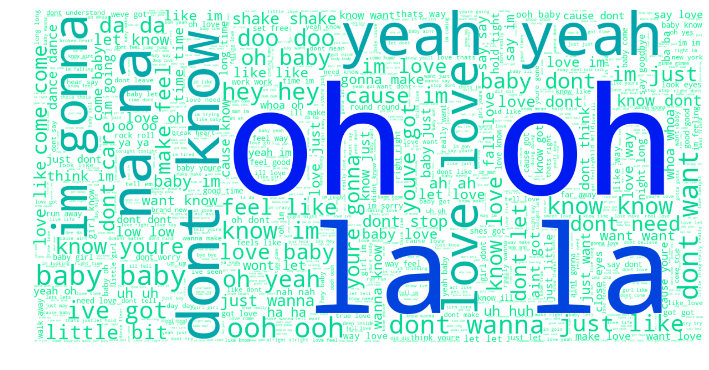

#### Love is Not Forever
The time series plot below shows the number of times **love** and **like** appear in Hot 100 songs for each year. Common wisdom holds that most Hot 100 songs are one way or another about love, and songs from the **late 1970s** and **1980s** certainly use the word quite a bit.

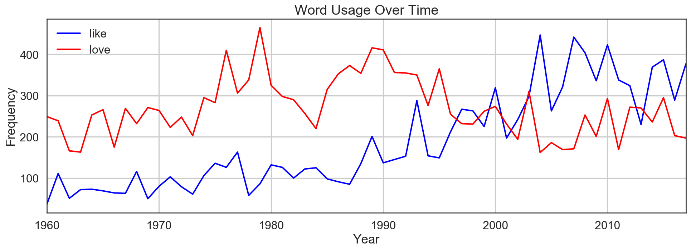

Since the **1960s**, the frequency with which _like_ has been used in Hot 100 songs has steadily risen, overtaking _love_ in the **early 2000s** and no doubt buoyed by its popular usage as a verbal tick.

#### Singing About Her

An immediately notable feature is how usage of the word **girl** skyrockets in the **2000s** before declining to **pre-2000** levels. During the same time there was also a smaller rise and fall in the usage of **man**.

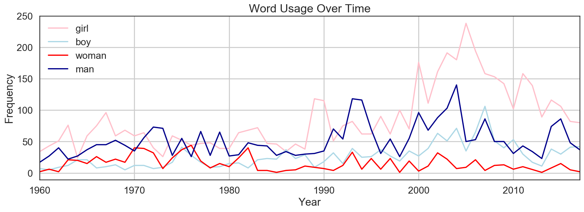

That **man** appears much more frequently than **woman**, and **girl** appears much more frequently than **boy** during this period could be the result of increased sexism and even misogyny in popular music. Once again, the timing of these trends coincide with that of hip hop and rap's rise to prominence.

#### Pronouns
A number of plots similar to the one below have been made in previous analyses about the evolution of lyrics in popular music. However, because they often fail to include the pronoun **you** when studying the usage of **I** and **me**, the conclusion is almost always some variant of, "Our culture is becoming so egotistical."

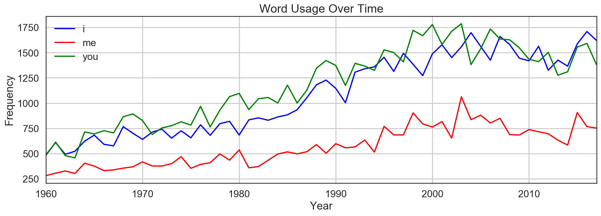

While this may still be true, the fact that usage of **you** increases at about the same pace as that of **I** suggests that rather than being egotistical, younger listeners simply prefer songs that are more personal and direct.

#### Related Words
Defining what constitutes a word's meaning has been the subject of longstanding philosophical discussions, but computationally, a popular technique has been to define a word's meaning by its context, i.e. what words tend to appear around it. For example, because the words **Senate** and **Congress** are more frequently in the vicinity of neighboring words like **government**, **Washington**, and **political** than a word like **fashion**, one could reasonably expect **Senate** and **Congress** to have more similar contexts than **Senate** and **fashion**.

The [Word2Vec](http://mccormickml.com/2016/04/19/word2vec-tutorial-the-skip-gram-model/) embedding procedure uses this notion to map words into a latent vector space such that words with similar semantic meanings are closer together in the latent space (i.e. have high cosine similarity) than words with different semantic meanings. I trained a Word2Vec model on the whole corpus of lyrics to generate **50**-dimensional word embeddings, then printed the **10** most similar words to **you**, **love**, **dance**, **oh**, and **money**.

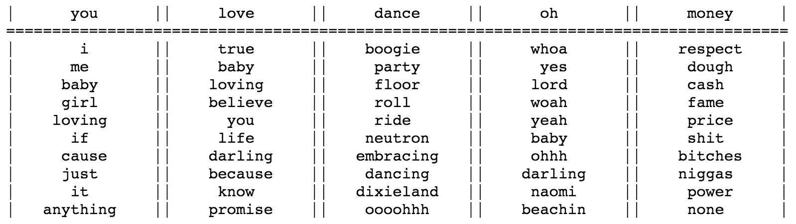

Note that while **you** is actually quite different from **i** and **me**, they are often surrounded by the same words, which is why **i** and **me** are considered highly similar to **you**. For the most part, the above table shows that the embeddings make sense, even the most similar words to **money**.

As with the [projections of songs](#embedding-in-latent-audio-space) onto a **2**-dimensional space using their audio features, the embedded words can also be projected down onto a **2**-dimensional space using TSNE. Below are the projections of the **200** most frequently used words. The projections appear reasonably coherent; **want**, **wanna**, and **need** form a local cluster, as do **light**, **sun**, and **rain**.

Once again, we observe that **money** is closely related to explicit words; perhaps while most artists are busy singing about love, rappers are more pre-occupied with wealth or the lack of it. The outsized attention African American artists pay to money and wealth in their songs could be yet another effect of [economic racial discrimination](https://www.epi.org/blog/the-racial-wealth-gap-how-african-americans-have-been-shortchanged-out-of-the-materials-to-build-wealth/).

#### Topic Modeling
Topic modeling is a method of discerning what types of topics exist within the corpus of lyrics and how much of each topic is present within each song. [Latent Dirichlet Allocation](http://blog.echen.me/2011/08/22/introduction-to-latent-dirichlet-allocation/) (LDA) is a particularly powerful technique that models topics as a distribution over words and songs as a distribution over topics. In modeling the lyrics, I found **6** topics to be ideal; more than that, and the topics either become incoherent or signficantly overlapped with each other. The word clouds below show the most probable words to appear in each topic, with my interpretation of the topic in each title.

#### Sign of the Times

To see which words are most characteristic of a particular decade, I trained a [naive Bayes classifier](http://blog.aylien.com/naive-bayes-for-dummies-a-simple-explanation/) to predict the decade of a song's release from the song's lyrics. The Naive Bayes model attempts to calculate the probability that a song belongs to a decade given its lyrics, and it does so, partially, by calculating the probability of each individual word appearing in the lyrics given each decade. This **probability of word given decade**, also called the **class conditional probability**, has been used by other analyses to determine which words are most characteristic of a decade. However, the class conditional probability by itself is not sufficient; it must be compared against an unconditional probability that the word will appear in the song regardless of decade. That is, we must calculate how many times the probability of a word appearing in a song given that song's decade is greater than the expected probability of the word in general. It is a principal taken from [market basket analysis](https://select-statistics.co.uk/blog/market-basket-analysis-understanding-customer-behaviour/) called **lift**; the higher the lift for a word given its decade, the more characteristic that word is of that decade.

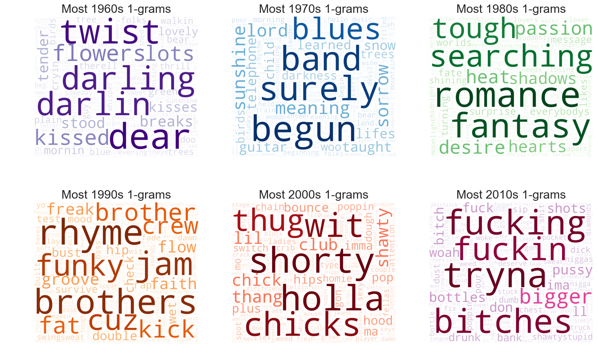

I calculated the lift that each decade gives to each unigram, and used these values to generate the word clouds above; greater lifts result in larger words. It appears that popular music was much more wholesome before the turn of the millennium. The same is apparent from the most characteristic bigrams below. Given that hip hop only gained traction in the Billboard charts in the 1990s, it is fitting that the bigram **hip hop** features so prominently where it does.

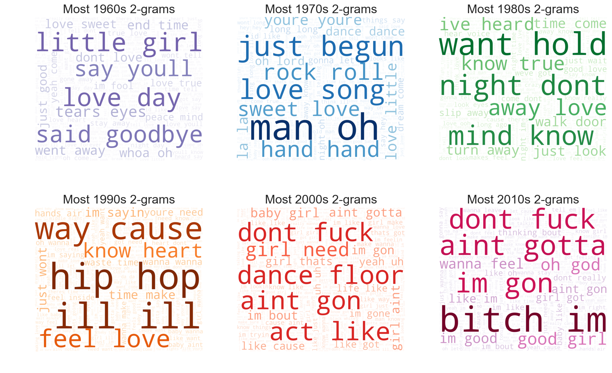

The most characteristic trigrams and 4-grams below stop making syntactic sense. Rather, the n-grams are mostly melodic embellishments.

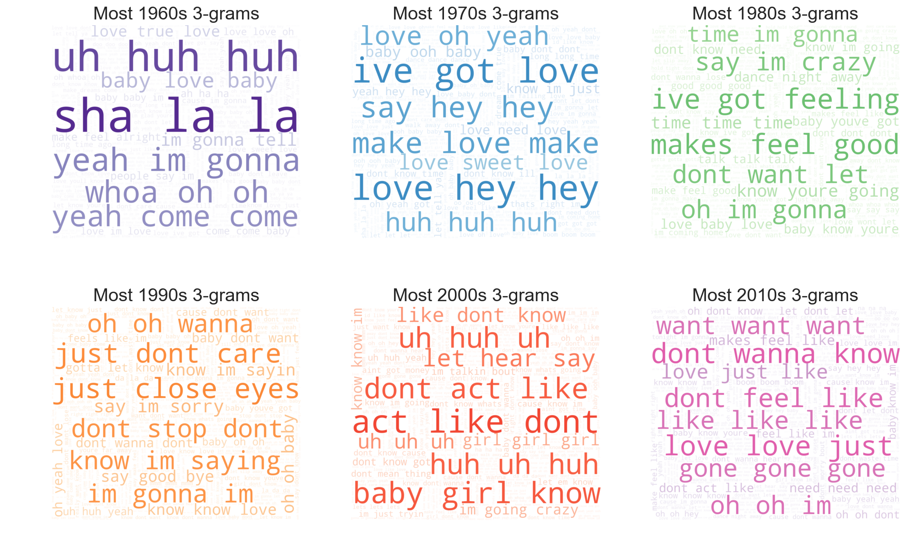

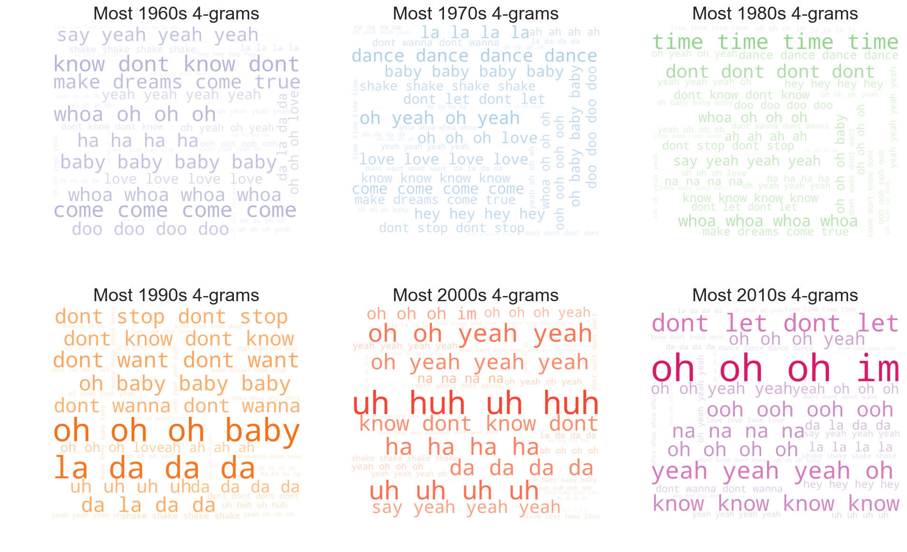

#### Extreme Words

In addition to being characterstic of particular decades, some words are more closely tied to high values of certain audio features. For example, given lyrics for all the Hot 100 songs and those songs' danceability, we can ask, "What are the most danceable words?"

One way to answer this question is to use [ridge regression](https://en.wikipedia.org/wiki/Tikhonov_regularization), treating the lyrics as explanatory variables and a target audio feature as the response variable. In learning how to predict the audio feature from lyrics, the regression will learn coefficients for each word. The larger the coefficient, the more closely related that word is to the target feature.

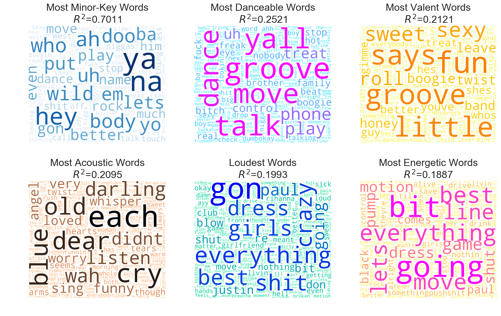

The word clouds above show the words with the largest coefficients for each target feature. The R2 value is a measure of how effectively the audio feature can be predicted using only the lyrics, with **1.0** indicating perfect predictions and **0.0** indicating no better than random guessing. While most of the audio features cannot be reliably predicted using only the lyrics, it appears that the most significant words for each audio feature is somewhat reasonable.

## Conclusion

Combining songs from the Billboard Year-End Hot 100 charts from **1960**-**2017**, lyrics scraped from the web, and audio feature data gathered from Spotify yielded many angles for understanding mainstream music and how it has evolved. Through a close examination of audio features, we observed a trend of songs becoming shorter, more energetic, louder, and less acoustic, ostensibly all reactions to a shrinking and increasingly competitive market for music. We also saw how the rise of rap and hip hop fundamentally changed the music industry, resulting in a striking increase in artist collaborations and leaving an indelible impression on the textual content of popular music. Including data from multiple sources also enabled the interesting use of supervised and unsupervised machine learning algorithms to extract additional insights, such as determining the most characteristic n-grams of each decade,  finding the most relevant words to each audio feature, and embedding songs, artists, and decades into a common latent space.

I hope that you enjoyed this extended analysis whether it confirmed your preconceived notions about popular music, offered new insights to ruminate on, or both. Knowing where the music industry has been provides important context for understanding where it is headed. If you have additional ideas about how to further expand or explore the dataset, I encourage you to download it from [here](https://github.com/zhao1701/spotify-song-lyric-analysis/blob/master/data/billboard-lyrics-spotify.csv). Thank you for reading!
